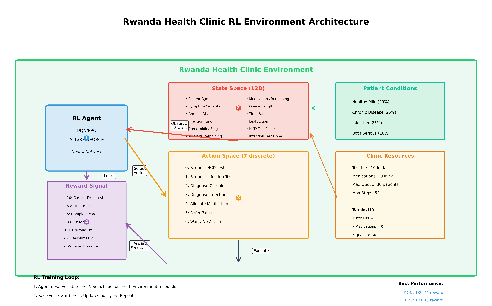

# Rwanda Health Clinic RL Agent

## Project Overview

This project applies reinforcement learning to healthcare decision-making in Rwanda's clinic settings. The system simulates a healthcare worker managing patient diagnoses, treatment decisions, and limited medical resources. Through training, the agent develops strategies for balancing patient care quality against resource constraints.

The environment models realistic challenges faced in resource-limited clinics: deciding when diagnostic tests are truly necessary, making diagnoses with incomplete information, allocating scarce medications effectively, and managing patient queues while maintaining care standards.


## Problem Statement

Healthcare workers in resource-limited clinics face constant trade-offs: deciding when diagnostic tests are necessary versus clinical assessment, allocating scarce medications, managing growing patient queues while maintaining accuracy, and determining when to refer patients to specialists. This simulation models these tensions, letting the RL agent learn optimal decision patterns through thousands of patient encounters.


## Environment Architecture



### State Space (12-dimensional continuous observation)

The agent observes:

1. **Patient age** (normalized 15-80 years)
2. **Symptom severity** (0.0-1.0)
3. **Chronic disease risk** (0.0-1.0)
4. **Infection risk** (0.0-1.0)
5. **Comorbidity flag** (0 or 1)
6. **Test kits remaining** (normalized)
7. **Medications remaining** (normalized)
8. **Queue length** (normalized)
9. **Time step** (normalized)
10. **Last action taken** (normalized)
11. **NCD test completed** (binary)
12. **Infection test completed** (binary)

### Action Space (7 discrete actions)

0. **Request NCD Test** - Order non-communicable disease screening
1. **Request Infection Test** - Order infection screening
2. **Diagnose Chronic** - Diagnose chronic condition
3. **Diagnose Infection** - Diagnose infection
4. **Allocate Medication** - Provide treatment
5. **Refer Patient** - Send to specialized facility
6. **Wait** - No action / observe

### Reward Structure

- **Correct diagnosis with test**: +10 points
- **Correct diagnosis without test**: +3 points (encourages efficiency)
- **Wrong diagnosis**: -6 to -10 points (severe penalty)
- **Successful treatment**: +6 to +8 points (higher for complex cases)
- **Complete patient care**: +5 bonus points
- **Appropriate referral**: +3 to +8 points
- **Resource depletion**: -10 points (terminal)
- **Queue overflow**: -10 points (terminal)
- **Queue pressure**: -1 × (queue_length / max_queue) per step
- **Redundant actions**: -3 to -5 points

### Patient Conditions (Probabilistic)

- **Healthy/Mild** (40%): Minimal intervention needed
- **Chronic Disease** (25%): Requires NCD testing and management
- **Infection** (25%): Requires infection testing and antibiotics
- **Both Serious** (10%): Complex comorbidity requiring comprehensive care

### Terminal Conditions

- Test kits depleted (= 0)
- Medications depleted (= 0)
- Queue overflow (≥ 30 patients)
- Max steps reached (50 steps default)


## Reinforcement Learning Algorithms

I implemented and compared four different RL approaches to see which works best for this healthcare decision-making task:

### 1. **DQN (Deep Q-Network)** - Value-Based

- **Best Performance**: 189.74 mean reward (run_08)
- **Architecture**: Deep neural network approximating Q-values
- **Key Features**: Experience replay, target network, epsilon-greedy exploration
- **Strengths**: Sample efficient, stable convergence

### 2. **PPO (Proximal Policy Optimization)** - Policy Gradient

- **Best Performance**: 171.40 mean reward (run_08)
- **Architecture**: Actor-critic with clipped surrogate objective
- **Key Features**: Trust region optimization, GAE advantages
- **Strengths**: Stable, robust to hyperparameters

### 3. **A2C (Advantage Actor-Critic)** - Actor-Critic

- **Best Performance**: 110.16 mean reward (run_01)
- **Architecture**: Synchronous actor-critic
- **Key Features**: Advantage function, value function baseline
- **Strengths**: Fast training, low memory usage

### 4. **REINFORCE** - Vanilla Policy Gradient

- **Best Performance**: -54.09 mean reward (run_04)
- **Architecture**: Monte Carlo policy gradient
- **Key Features**: Episode-based learning, entropy regularization
- **Strengths**: Simple, interpretable, works in continuous action spaces


## Results Summary

| Algorithm     | Best Run | Mean Reward | Std Reward | Training Time |
| - | -- | -- | - | - |
| **DQN**       | run_08   | **189.74**  | 44.92      | 1097s         |
| **PPO**       | run_08   | **171.40**  | 33.53      | 583s          |
| **A2C**       | run_01   | **110.16**  | 50.61      | 756s          |
| **REINFORCE** | run_04   | -54.09      | 2.40       | 211s          |

### Key Findings

DQN emerged as the strongest performer, achieving nearly 190 average reward across evaluation episodes. This makes sense given its experience replay mechanism, which lets it learn efficiently from past experiences. PPO came in second but trained almost twice as fast, making it a practical alternative for resource-constrained settings.

A2C performed moderately well but showed high variance - some runs worked great, others not so much. This inconsistency suggests it's more sensitive to hyperparameter choices. REINFORCE consistently underperformed, which isn't surprising given it's the simplest algorithm tested. The environment's complexity and long episode lengths seem to require more sophisticated methods.

More detailed analysis with learning curves and statistical comparisons can be found in `training/results_analysis.ipynb`.


## Installation & Setup

### Prerequisites

- Python 3.8+
- pip package manager
- Virtual environment (recommended)

### Installation Steps

1. **Clone the repository**

   ```bash
   git clone https://github.com/aimee-annabelle/reinforcement-learning-ml-techniques-2-summative.git
   cd reinforcement-learning-ml-techniques-2-summative
   ```

2. **Create virtual environment** (recommended)

   ```bash
   python -m venv .venv

   # Windows
   .venv\Scripts\activate

   # Linux/Mac
   source .venv/bin/activate
   ```

3. **Install dependencies**
   ```bash
   pip install -r requirements.txt
   ```

### Dependencies

- `gymnasium==0.29.1` - OpenAI Gym environment interface
- `stable-baselines3==2.3.0` - RL algorithms implementation
- `torch==2.9.1` - Deep learning framework
- `numpy==2.1.3` - Numerical computations
- `pygame-ce==2.5.1` - Visualization and rendering
- `tensorboard==2.17.1` - Training monitoring


## Usage

### 1. Visualize Environment with Random Agent

Test the environment visualization without any trained model:

```bash
python environment/demo_visualization.py
```

This displays the GUI with an agent taking random actions, demonstrating:

- Patient state visualization
- Resource tracking (test kits, medications)
- Queue management display
- Action feedback
- Reward display

### 2. Run Best Trained Agent

Simulate the best-performing agent with GUI visualization:

```bash
python main.py --episodes 5
```
or
```bash
python main.py --episodes 5 --render-mode human --deterministic --step-delay 0.5
```

Options:

- `--episodes N` - Number of episodes to simulate (default: 1)
- `--algo {dqn,ppo,a2c,reinforce}` - Specify algorithm (default: auto-select best)
- `--run RUN_ID` - Specify run (e.g., run_08)

Example:

```bash
python main.py --algo dqn --run run_08 --episodes 3
```

### 3. Train New Models

Train all algorithms (10 runs each):

```bash
python training/train_models.py --algo all
```

Train specific algorithm:

```bash
python training/train_models.py --algo dqn --max-combos 10
```

Train individual algorithms:

```bash
python training/dqn_training.py    # Train DQN
python training/ppo_training.py    # Train PPO
python training/a2c_training.py    # Train A2C
python training/pg_training.py     # Train REINFORCE
```

Training options:

- `--algo {all,dqn,ppo,a2c,reinforce}` - Algorithm selection
- `--max-combos N` - Limit hyperparameter configurations
- `--total-timesteps N` - Override training duration
- `--seed N` - Random seed for reproducibility
- `--device {auto,cpu,cuda}` - Computation device

### 4. Analyze Results

Launch Jupyter notebook for interactive analysis:

```bash
jupyter notebook training/results_analysis.ipynb
```

### 5. Monitor Training

Launch TensorBoard to monitor training:

```bash
tensorboard --logdir training_logs
```


## Project Structure

```
reinforcement-learning-ml-techniques-2-summative/
│
├── environment/
│   ├── custom_env.py           # RwandaHealthEnv Gymnasium environment
│   ├── rendering.py            # Pygame visualization components
│   ├── demo_visualization.py   # Random agent demonstration
│   ├── test_rendering.py       # Rendering tests
│   └── RENDERING_README.md     # Rendering documentation
│
├── training/
│   ├── train_models.py         # Main training orchestrator
│   ├── dqn_training.py         # DQN training script
│   ├── ppo_training.py         # PPO training script
│   ├── a2c_training.py         # A2C training script
│   ├── pg_training.py          # REINFORCE training script
│   ├── reinforce_agent.py      # Vanilla REINFORCE implementation
│   ├── hyperparam_configs.py   # Hyperparameter search spaces
│   ├── results_analysis.ipynb  # Results analysis notebook
│   └── reports/
│       ├── summary_metrics.csv     # Consolidated metrics
│       ├── detailed_metrics.csv    # Per-run detailed metrics
│       ├── eval_timeseries.csv     # Time-series evaluation data
│       ├── top_models.csv          # Best performing models
│       └── top_models.md           # Markdown summary
│
├── models/
│   ├── dqn/                    # DQN trained models (10 runs)
│   ├── ppo/                    # PPO trained models (10 runs)
│   ├── a2c/                    # A2C trained models (10 runs)
│   └── pg/                     # REINFORCE trained models (10 runs)
│       └── run_XX/
│           ├── best_model/         # Best checkpoint
│           ├── final_model.zip     # Final model
│           ├── metadata.json       # Run configuration
│           └── eval_logs/          # Evaluation logs
│
├── training_logs/              # TensorBoard logs
│   ├── dqn/
│   ├── ppo/
│   ├── a2c/
│   └── reinforce/
│
├── docs/                       # Documentation and diagrams
│   └── environment_diagram.png
│
├── main.py                     # Entry point for simulation
├── requirements.txt            # Project dependencies
├── README.md                   # This file
└── .gitignore                  # Git ignore rules
```


## Hyperparameter Tuning

Each algorithm was trained with 10 different hyperparameter configurations. This wasn't random - I systematically varied key parameters that previous research has shown to be important:

### DQN Hyperparameters

- Learning rates: 1e-4 to 1e-3
- Gamma (discount): 0.95 to 0.99
- Buffer sizes: 50k to 150k
- Batch sizes: 64 to 256
- Exploration: 0.1 to 0.3 fraction, 0.005 to 0.02 final epsilon
- Network architectures: [128,128] to [512,256]

### PPO Hyperparameters

- Learning rates: 1e-4 to 7e-4
- Gamma: 0.97 to 0.995
- n_steps: 768 to 2048
- Batch sizes: 128 to 512
- Clip range: 0.15 to 0.3
- GAE lambda: 0.9 to 0.97
- Entropy coefficient: 0.0 to 0.02

### A2C Hyperparameters

- Learning rates: 2e-4 to 1e-3
- Gamma: 0.96 to 0.995
- n_steps: 5 to 10
- GAE lambda: 0.9 to 0.97
- Entropy coefficient: 0.0 to 0.02
- Network architectures: [128,128] to [256,256,128]

### REINFORCE Hyperparameters

- Learning rates: 2.5e-4 to 1.2e-3
- Gamma: 0.96 to 0.995
- Episodes: 300 to 600
- Batch episodes: 1 to 3
- Entropy coefficient: 0.0 to 0.003
- Hidden layers: [128,128] to [256,256,128]

**Complete hyperparameter configurations**: `training/hyperparam_configs.py`


## Agent Behavior

The trained DQN agent developed several key strategies: risk-stratified testing (high chronic risk → NCD test, high infection risk → infection test), conservative medication use (only after confirmed diagnosis), consistent referral of BOTH_SERIOUS cases, and adaptive resource management (more selective testing when supplies are low). The agent balances queue management pressure with diagnostic accuracy, following a learned decision tree based on patient characteristics.


## Performance Metrics

Models were evaluated on mean episode reward (overall performance), standard deviation (policy consistency), best callback reward (peak performance), training time (efficiency), and resource usage patterns (test kits and medications per successful treatment).


## Technical Implementation

The environment uses the Gymnasium API with normalized observations [0, 1]. Stochastic patient presentations match real clinic distributions. Training uses Stable Baselines3 with evaluation callbacks, early stopping, and TensorBoard logging. The Pygame visualization provides real-time multi-panel feedback on patient state, resources, queue status, and rewards.


## Testing

Run environment tests:

```bash
python environment/test_rendering.py
```

Validate training pipeline:

```bash
python training/train_models.py --algo dqn --max-combos 1 --total-timesteps 1000
```


## Future Improvements

Potential enhancements include multi-agent scenarios, periodic resource replenishment, more granular patient severity levels, explicit time constraints, financial modeling, advanced algorithms (SAC, Rainbow DQN), curriculum learning, and transfer learning. Real-world deployment would require integration with health records, privacy measures, interpretability tools for clinician trust, and careful A/B testing for patient safety.
